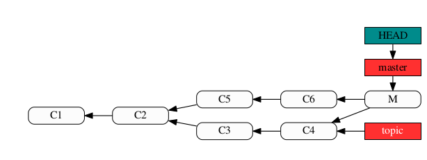

   上次在合并bus-0916到bus-0923上时，我遇到了revert reverted merge 问题。 经过这段时间的调查与分析，现在对该问题有了初步的认识，故而跟大家分享一下。

###此次事件给我的启示
1. **严格遵循代码提交流程，切勿未在本地编译，自测就直接push到远程代码仓库。一旦出错，错误挽回成本很高。**
2. **在决定撤销一个有问题的merge之前，要保持谨慎与清醒。**

###事件回顾
   9月20号上午接到了庆超委派的一个任务，需要将bus-0916 合并到bus-0923上。 由于本机环境问题，处理合并冲突出现了错误。当时任务比较紧急，且冲突主要是集中在文案相关的文件中，在处理完冲突后，我并没有执行本地编译验证的过程，便将合并后的提交push到了远程分支，而合并错误则是在build bot 编译报错时才被发现。

   执行过程可用下图1来抽象表述【为了方便图示表达bus-0923与下图中的master 分支等同，bus-0916与topic 分支等同】。



                                                              图1

   为了解决冲突，我执行了git revert -m 1 HEAD 命令，撤销了这一次的merge. 并且将这次提交push 到了远程分支，以期build bot 上能够编译出可以测试版本。 执行过程如下图2所示。


                                                              图2

   之所以采用revert 命令，是我希望我能有第二次merge，第二次处理冲突的过程。于是我尝试了如下三种操作。
   1. 调用git merge topic 命令，在git 命令行shell 输出 Already up-to-date，而非我期望看到的处理冲突的提示。查看日志以及比较文件，并没有看到有冲突文件，也没有看到有新的提交产生。
   2. 查阅网上资料以后，找到了git scm 上一篇[高级合并的文章](http://git-scm.com/book/zh/v2/Git-工具-高级合并#撤消合并)，发现有一个revert reverted merge 的处理过程，貌似可以满足要求。
   随后执行了git revert -m 1 ^M ，随后再执行git merge topic 命令，结果与1）中描述一致。git revert -m 1 ^M 执行之后的过程如下图3所示。


                                                              图3

   会生成一个新的提交^^M，C3，C4并不会在master分支上。
   3. 由于当时时间比较紧急，并没有再花时间来研究其中的root cause. 在与弗丁，慧甫讨论后，采用了重新创建分支，进行重放的办法来实现了第二次处理冲突的过程。重放过程如下
     * 在bus-0923的基础上重新创建了一个修复分支 bus-0923-fix 。
     * 将bus-0923-fix 分支reset 到C6这个位置。
     * 再执行git merge bus-0916 命令。
     * 解决合并冲突，本地验证通过，将bus-0923-fix push 到远端分支，9月23号的班车发布分支调整为bus-0923-fix进一步发布。
           
###问题到底出在哪里？

   针对上述描述的问题，我犯了两个错误。
   1. 在向远程分支push 代码之前未进行本地编译，验证（这里的验证要包括功能测试）。如执行了本地验证，发现问题后，在本地执行reset命令，即可再次重新处理冲突。
   2. 在对git revert 命令的认识不够深入的情况下，盲目执行git revert命令。
   这段时间一直在追溯问题的根源，一边查看git 相关问题，一边自己建立测试分支，来模拟问题现场，未找到根本原因。
   直到昨天在github 上搜到的一篇文章 https://github.com/git/git/blob/master/Documentation/howto/revert-a-faulty-merge.txt。
   该文中详细讨论了如何撤销一个错误的合并。 git对于 revert 命令的处理，revert-a-faulty-merge.txt中 Linus Torvalds 给出了详细解答。

```
        Reverting a regular commit just effectively undoes what that commit
        did, and is fairly straightforward. But reverting a merge commit also
        undoes the _data_ that the commit changed, but it does absolutely
        nothing to the effects on _history_ that the merge had.

        So the merge will still exist, and it will still be seen as joining
        the two branches together, and future merges will see that merge as
        the last shared state - and the revert that reverted the merge brought
        in will not affect that at all.

        So a "revert" undoes the data changes, but it's very much _not_ an
        "undo" in the sense that it doesn't undo the effects of a commit on
        the repository history.
 
        So if you think of "revert" as "undo", then you're going to always
        miss this part of reverts. Yes, it undoes the data, but no, it doesn't
        undo history.
```

  简单说来就是，如果是revert 一个常规的提交，那么这个提交所涉及到变更将全部回滚。但是如果是revert 一个merge 提交，那么仅仅是会回滚merge 过程中产生的新的提交即图1，图2中的提交M，但是不会影响到历史数据。
  亦即原始的合并仍然存在，后面再执行的合并操作将会沿用最先执行的merge 结果。因此通过revert reverted merge 之后，再次调用git merge 命令，也无法实现二次处理冲突的机会。现在看来，当时我最终的处理方法还是一个相对可行的。

###什么时候会需要 revert reverted merge呢？
   根据我个人理解，在如下场景会需要 revert reverted merge
   1. 当我们将topic 分支合并到master 以后，发现在topic 分支引入了bug，而不是我所遇到的场景。其过程可参考图1。
   2. 为了不影响master的进一步演进，执行了git revert -m 1 HEAD 后，先在topic 分支修复bug，此时会产生一个新的提交C7。其过程可参考图2。
   3. 此时需要再次将topic分支合入master，可以先执行git revert ^M，再执行git merge topic 命令，即可完成我们期望的合并，topic 分支合入master,同时也包含了C7的内容。执行过程如下图4所示。


                                                               图4
   ^M与^^M抵消了。 ^^M事实上合并入了 C3与 C4 的修改，C8 合并了 C7 的修改，所以现在 topic 已经完全被合并了。

###重要的参考文章
关于 如何revert 一个有问题的merge，请详细阅读这两篇文章，相信你一定会有收获。也欢迎大家给出更加perfect的解决方案。
1. https://github.com/git/git/blob/master/Documentation/howto/revert-a-faulty-merge.txt
2. http://git-scm.com/book/zh/v2/Git-工具-高级合并#撤消合并
